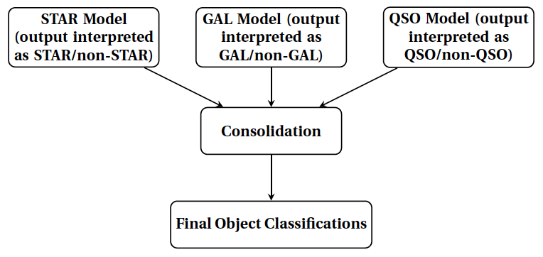
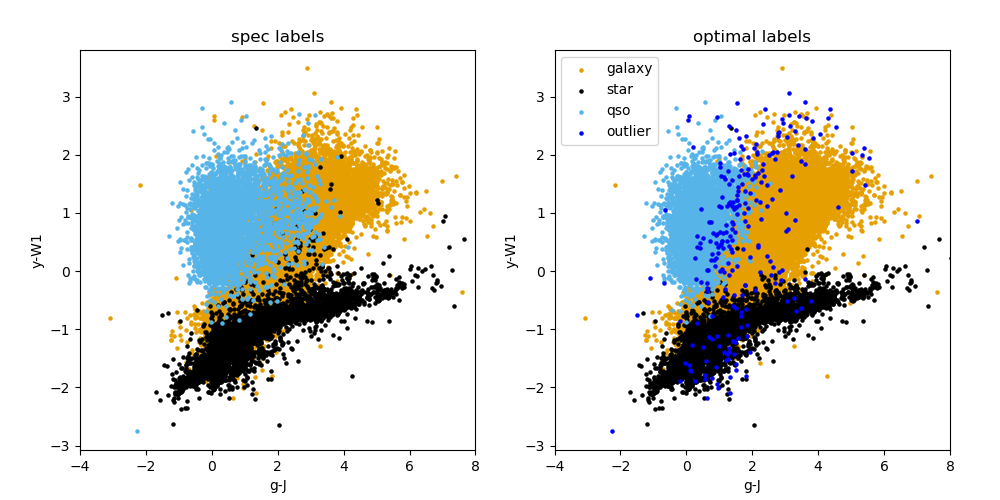
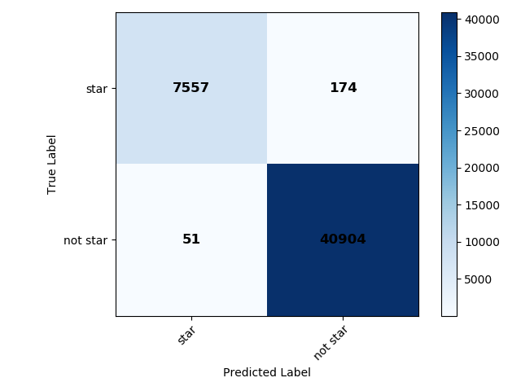

.. _consolidation:

classifier\_consolidation module
================================

.. automodule:: classifier_consolidation
   :members:
   :undoc-members:
   :show-inheritance:

The consolidation stage in this pipeline includes two methods as detailed in Section 5.3
in `Logan and Fotopoulou (2020) <http://https://ui.adsabs.harvard.edu/abs/2020A%26A...633A.154L/abstract>`_.
The relevant text is copied here for reference:

*Optimal method*: For data points that are classified positively
by two binary classifiers separately, we assign the point to the
rarest object class, as follows: (i) sources classified as both STAR
and GAL, we call STAR; (ii) sources classified as both QSO and
GAL, we call QSO; (iii) sources classified as both STAR and
QSO, we call QSO.
We also define an outlier class, (different to the HDBSCAN
outlier class) that we refer to as the “post-consolidation outlier”
class. These post-consolidation outliers are those that are not
classified positively by any of the binary classifiers.

*Alternative method*: The second consolidation method we
investigated, which we refer to as the “alternative” method, we
simply reassign all doubly positively classified objects to the
post-consolidation outlier class.

In the :ref:`consolidation` this consolidation step is done for
the labels that are predicted for the best HDBSCAN classifier setup as found
in the :ref:`binary`. We note that these labels are those predicted
by our setup for data that have known labels. We note that the consolidation step
is also run in the :ref:`predict`.
The main idea of this script is summarized in the flowchart below:

*****
Description of code
*****
We now run through the code written in the :ref:`consolidation`:

**Data read-in and setup**: The function ``get_data`` is used
to read in the catalogue data, and then the binary labels from each of the three
classifiers' labels are read in to a dictionary ``dict_predicted_labels``.

**Consolidation step and colour plots**: The function ``find_object_indices``
is called and returns a list of label indices (e.g. for where a star and a galaxy
are positively identified by their respective classifier) that is then passed to
the function ``do_consolidation`` that returns the final consolidated labels
(for both consolidation methods mentioned above). The final consolidated labels
are also plotted with the function ``plot_classification``, and the pre- and
post- consolidation labels appended to the original catalogue and saved to file.
Information regarding the number of objects before and after consolidation is also
returned by the ``find_object_indices`` and ``plot_classification`` functions
respectively, and written to a text file.

**Metric scores**: The final consolidated labels are then passed
to the function ``compute_metric_scores`` which computes various performance
metrics for the labels, which are also written to a text file.

**Confusion matrices**: The function ``plot_confusion_matrix``
is then used to plot confusion matrices (normalized and not normalized) for the
output labels for both consolidation methods and these are saved.

**Outputs**: The images output from this module run can be found in the data/output/consolidation
directory. They include colour plots for both consolidation methods (an example for the optimal
consolidation method is shown below), and confusion
plots for both consolidation methods and for each binary classifier separately
after consolidation (those for the star classifier, both normalized and
unnormalized are shown below for the optimal consoldiation method), and for all objects at once.
Useful text files, such as the summary of the consolidation step and metrics can be found
in the same directory. The catalogue with predicted labels is also given in this directory.

.. image:: images/CPz_confusion_plot_star_normalized_consolidation_optimal.png
  :width: 400
