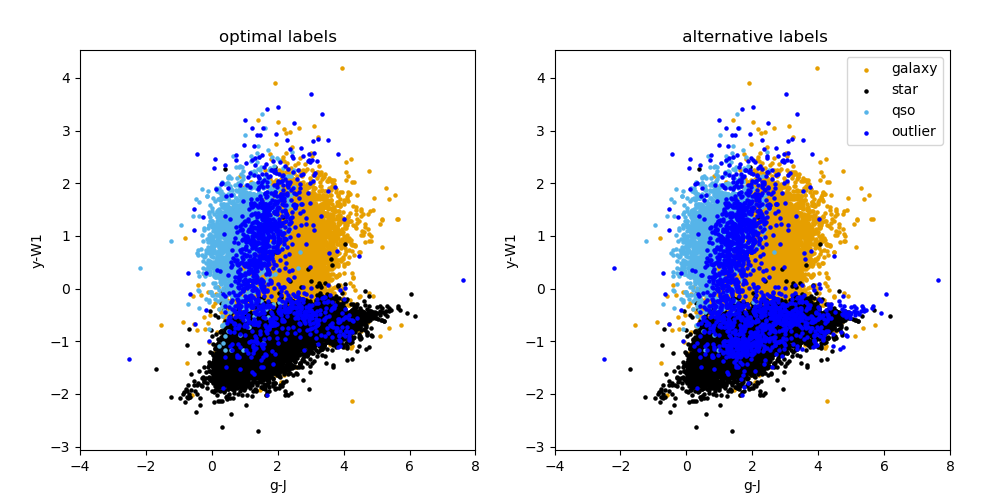

.. _predict:

predict module
==============

.. automodule:: predict
   :members:
   :undoc-members:
   :show-inheritance:

Prediction / Application to new data: The prediction stage involves using the three saved binary HDBSCAN models
(using the best setups found in the gridsearch stage in the :ref:`binary`),
that are trained on the known dataset, that has labels. We then use these trained
binary models to predict the classes of new data points. These new predicted labels
then undergo the consolidation stage to provide the final predicted labels.

*****
Description of code
*****
**Data read-in and preparation**: ``get_data`` and ``get_all_features``
are used as in the :ref:`binary`, but this time on the new catalogue for which
labels are to be predicted. Additionally in this script the saved scaler model
from the :ref:`binary` is loaded and the new input data scaled by
this pre-trained model. It is important that the scaling that is done on this new
data is the same as that done on the training data.

**Predict new labels**: For each of the three binary classifiers, the new scaled data is then reduced to
have just the attributes that were selected in the HDBSCAN gridsearch step in
binary, for the best classifier setup (this is done using
``select_important_attributes`` after obtaining the number of top attributes
from the list of important attributes found from the RF using ``find_best_hdbscan_setup``).
The relevant pre-trained PCA model then is loaded and the appropriate PCA reduction
is performed on the new data (again it is important that the PCA reduction that is
done on this new data is the same as that done on the training data for the bests
model setup). The position in this PCA space for each datapoint in the prediction catalogue is saved to a text file.
The new data (that has now been both scaled and reduced to a lower
number of dimensions by PCA) is now ready to be fed to the pre-trained HDBSCAN
clusterer. This prediction step by the pre-trained HDBSCAN clusterer is done
with the ``hdbscan.approximate_predict`` call. These output labels for each
object type are then binarized and appended to the input catalogue.

**Consolidation step**: As in consolidation, the ``find_object_indices`` and ``do_consolidation``
functions are used in a similar manner, and the final consolidated labels produced.
Information regarding the number of objects in each class before and after consolidation
is saved to a text file. The final catalogue with these consolidated labels appended
is also saved. Finally colour plots of the final predicted labels are also made using
the ``plot_classification`` function.

**Outputs**: The only image output from this module run is a colour plot of both consolidation methods
(an example is shown below).
It can be found in the data/output/predict directory. A text file with the summary of the
prediction labels after consolidation step can be found in the same directory.
The catalogue with predicted labels is also given in this directory.

